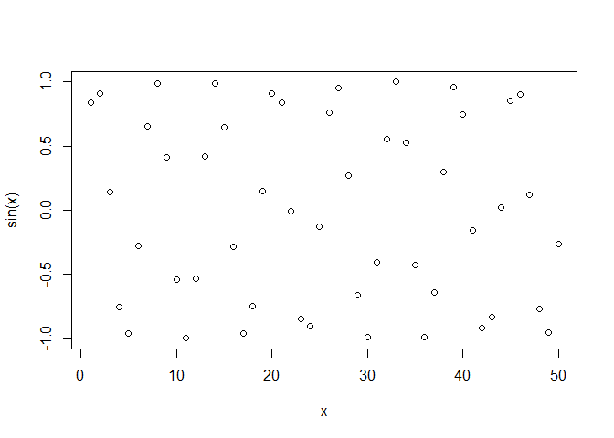
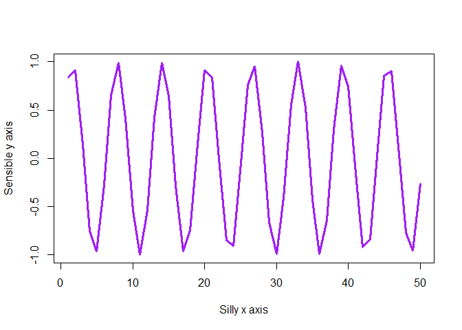

# Intro to R
Dalena Pham (PID:A17327787)
Invalid Date

``` r
#My first R script
x<-1:50
plot(x,sin(x))
```



``` r
plot(x,sin(x),typ="l",col="purple",lwd=3,xlab="Silly x axis",
ylab="Sensible y axis")
```


