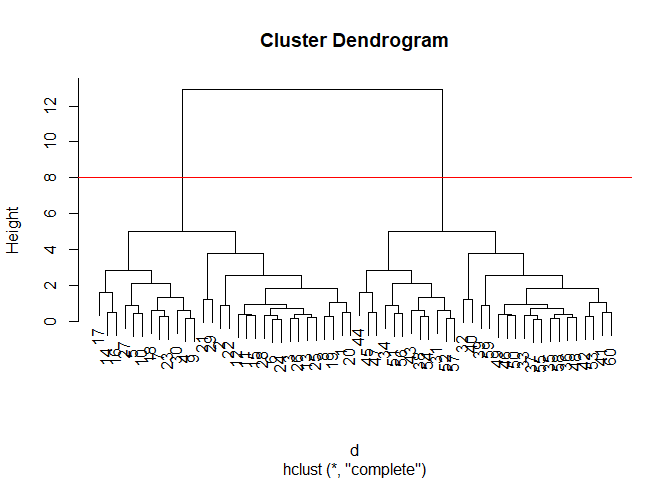
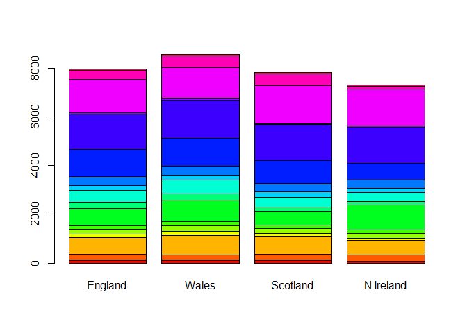

# Class 7: Machine Learning 1
Dalena (PID: A17327787)

- [Clustering](#clustering)
  - [K-means](#k-means)
  - [Hierarchical Clustering](#hierarchical-clustering)
- [Principal Component Analysis
  (PCA)](#principal-component-analysis-pca)
  - [Data import](#data-import)
  - [PCA to the rescue](#pca-to-the-rescue)
  - [Interpreting PCA results](#interpreting-pca-results)

Today we will explore unsupervised machine learning methods starting
with clustering and dimensionality reduction.

## Clustering

To start let’s make up some data to cluster where we know where the
answer should be. The `rnorm()` function will help us here.

``` r
hist(rnorm(1000, mean =3))
```


Return 30 numbers centered on -3

``` r
tmp <- c(rnorm(30, mean = -3),
  rnorm(30, mean = 3))

x <- cbind(x=tmp, y=rev(tmp))

x
```

                   x          y
     [1,] -2.1131139  1.7242679
     [2,] -1.7494982  4.2663746
     [3,] -2.2283952  3.2332462
     [4,] -3.2194917  3.3133783
     [5,] -4.5748926  4.1365771
     [6,] -2.3804876  3.2576491
     [7,] -3.2117732  3.8476282
     [8,] -1.5191610  2.5536645
     [9,] -3.2535705  3.1952292
    [10,] -4.3931729  3.7742974
    [11,] -2.8189577  2.9183536
    [12,] -2.7259453  2.6133116
    [13,] -1.9461591  3.0370792
    [14,] -3.2590968  1.8985684
    [15,] -2.5068480  2.9152560
    [16,] -3.6797721  1.6522696
    [17,] -4.8386652  1.6243486
    [18,] -3.7610174  4.0320897
    [19,] -1.7534839  2.6044057
    [20,] -1.8042371  2.0840526
    [21,] -1.5997827  0.4947533
    [22,] -2.5374932  3.9166249
    [23,] -3.3824581  3.6448537
    [24,] -2.4575782  3.1916273
    [25,] -2.0891762  2.9110803
    [26,] -2.1188936  3.1531955
    [27,] -5.2309634  3.8878391
    [28,] -2.4906060  3.4968345
    [29,] -2.6492234  1.0398064
    [30,] -3.4431348  2.7781200
    [31,]  2.7781200 -3.4431348
    [32,]  1.0398064 -2.6492234
    [33,]  3.4968345 -2.4906060
    [34,]  3.8878391 -5.2309634
    [35,]  3.1531955 -2.1188936
    [36,]  2.9110803 -2.0891762
    [37,]  3.1916273 -2.4575782
    [38,]  3.6448537 -3.3824581
    [39,]  3.9166249 -2.5374932
    [40,]  0.4947533 -1.5997827
    [41,]  2.0840526 -1.8042371
    [42,]  2.6044057 -1.7534839
    [43,]  4.0320897 -3.7610174
    [44,]  1.6243486 -4.8386652
    [45,]  1.6522696 -3.6797721
    [46,]  2.9152560 -2.5068480
    [47,]  1.8985684 -3.2590968
    [48,]  3.0370792 -1.9461591
    [49,]  2.6133116 -2.7259453
    [50,]  2.9183536 -2.8189577
    [51,]  3.7742974 -4.3931729
    [52,]  3.1952292 -3.2535705
    [53,]  2.5536645 -1.5191610
    [54,]  3.8476282 -3.2117732
    [55,]  3.2576491 -2.3804876
    [56,]  4.1365771 -4.5748926
    [57,]  3.3133783 -3.2194917
    [58,]  3.2332462 -2.2283952
    [59,]  4.2663746 -1.7494982
    [60,]  1.7242679 -2.1131139

Make a plot of `x`

``` r
plot(x)
```


### K-means

The main function in “base R” for K-means clustering is called
`kmeans()`:

``` r
km <- kmeans(x, centers=2)
km
```

    K-means clustering with 2 clusters of sizes 30, 30

    Cluster means:
              x         y
    1 -2.857902  2.906559
    2  2.906559 -2.857902

    Clustering vector:
     [1] 1 1 1 1 1 1 1 1 1 1 1 1 1 1 1 1 1 1 1 1 1 1 1 1 1 1 1 1 1 1 2 2 2 2 2 2 2 2
    [39] 2 2 2 2 2 2 2 2 2 2 2 2 2 2 2 2 2 2 2 2 2 2

    Within cluster sum of squares by cluster:
    [1] 53.91644 53.91644
     (between_SS / total_SS =  90.2 %)

    Available components:

    [1] "cluster"      "centers"      "totss"        "withinss"     "tot.withinss"
    [6] "betweenss"    "size"         "iter"         "ifault"      

The `kmeans()` function return a “list” with 9 components. You can see
the named components of any list with the `attributes()` function.

``` r
attributes(km)
```

    $names
    [1] "cluster"      "centers"      "totss"        "withinss"     "tot.withinss"
    [6] "betweenss"    "size"         "iter"         "ifault"      

    $class
    [1] "kmeans"

> Q. How many points are in each cluster?

``` r
km$size
```

    [1] 30 30

> Q. Cluster assignment/membership vector?

``` r
km$cluster
```

     [1] 1 1 1 1 1 1 1 1 1 1 1 1 1 1 1 1 1 1 1 1 1 1 1 1 1 1 1 1 1 1 2 2 2 2 2 2 2 2
    [39] 2 2 2 2 2 2 2 2 2 2 2 2 2 2 2 2 2 2 2 2 2 2

> Q. Cluster centers?

``` r
km$centers
```

              x         y
    1 -2.857902  2.906559
    2  2.906559 -2.857902

> Q. Make a plot of our `kmeans()` results showing cluster assignment
> using different colors for each cluster/group of points and cluster
> centers.

``` r
plot(x, col=km$cluster)
points(km$centers,col="blue",pch=15,cex=2)
```


> Q. Run `kmeans()` again on `x` and this cluster into 4 groups/clusters
> and plot the same result figure as above.

``` r
km_4 <- kmeans(x, centers=4)
plot(x, col=km_4$cluster)
points(km_4$centers,col="blue",pch=15,cex=2)
```


``` r
## there doesn't exist 4 clusters, so kmeans just puts points to where it thinks it could be 
```

> **key-point**: K-means clustering is super popular but can be misused.
> One big limitation is that it can impose a clustering pattern on your
> data even if clear natural grouping doesn’t exist - i.e. does what you
> tell it to do in terms of `centers`.

### Hierarchical Clustering

The main function in “base” R for hierarchical clustering is called
`hclust()`

You can’t just pass our dataset as is into `hclust()` you must give
“distance matrix” as input. We can get this from the `dist()` function
in R.

``` r
d <- dist(x)
hc <-hclust(d)
hc
```


    Call:
    hclust(d = d)

    Cluster method   : complete 
    Distance         : euclidean 
    Number of objects: 60 

The results of `hclust()` doesn’t have a useful `print()` method but do
have a special `plot()` method.

``` r
plot(hc)
abline(h=8,col="red")
```



``` r
## dendogram works to connect close matching regions in a hierarchical fashion, eventually connecting all
```

To get our main cluster assignment (membership vector) we need to “cut”
the tree at the big goal posts…

``` r
grps<-cutree(hc, h=8)
grps
```

     [1] 1 1 1 1 1 1 1 1 1 1 1 1 1 1 1 1 1 1 1 1 1 1 1 1 1 1 1 1 1 1 2 2 2 2 2 2 2 2
    [39] 2 2 2 2 2 2 2 2 2 2 2 2 2 2 2 2 2 2 2 2 2 2

``` r
table(grps)
```

    grps
     1  2 
    30 30 

``` r
plot(x,col=grps)
```


Hierarchical Clustering is distinct in that the dendrogram (tree figure)
can reveal the potential grouping in your data (unlike K-means)

## Principal Component Analysis (PCA)

PCA is a common and highly useful dimensionality reduction technique
used in many fields - particularly bioinformatics.

Here we will analyze some data from the UK on food consumption.

### Data import

``` r
url <- "https://tinyurl.com/UK-foods"
x <- read.csv(url)

head(x)
```

                   X England Wales Scotland N.Ireland
    1         Cheese     105   103      103        66
    2  Carcass_meat      245   227      242       267
    3    Other_meat      685   803      750       586
    4           Fish     147   160      122        93
    5 Fats_and_oils      193   235      184       209
    6         Sugars     156   175      147       139

``` r
rownames(x)<-x[,1]
x <- x[,-1]
head(x)
```

                   England Wales Scotland N.Ireland
    Cheese             105   103      103        66
    Carcass_meat       245   227      242       267
    Other_meat         685   803      750       586
    Fish               147   160      122        93
    Fats_and_oils      193   235      184       209
    Sugars             156   175      147       139

``` r
x <-read.csv(url,row.names=1)
head(x)
```

                   England Wales Scotland N.Ireland
    Cheese             105   103      103        66
    Carcass_meat       245   227      242       267
    Other_meat         685   803      750       586
    Fish               147   160      122        93
    Fats_and_oils      193   235      184       209
    Sugars             156   175      147       139

``` r
barplot(as.matrix(x),beside=F,col=rainbow(nrow(x)))
```



``` r
## barplot just shows the distribution of each row
```

One conventional plot that can be useful is called a “paris” plot (plot
of all pairwise combinations against each other).

``` r
pairs(x, col=rainbow(nrow(x)),pch=16)
```


``` r
## paris plot compares the countries to each other
```

### PCA to the rescue

The main function in base R for PCA is called `prcomp()`

``` r
pca <- prcomp(t(x))
summary(pca)
```

    Importance of components:
                                PC1      PC2      PC3       PC4
    Standard deviation     324.1502 212.7478 73.87622 3.176e-14
    Proportion of Variance   0.6744   0.2905  0.03503 0.000e+00
    Cumulative Proportion    0.6744   0.9650  1.00000 1.000e+00

The `prcomp()` function returns a list object of our results with five
attributes/components.

``` r
attributes(pca)
```

    $names
    [1] "sdev"     "rotation" "center"   "scale"    "x"       

    $class
    [1] "prcomp"

### Interpreting PCA results

The two main “results” in here are `pca$x` and `pca$rotation`. The first
of these (`pca$x`) contains the scores of the data on the new PC axis –
we use these to make our “PCA plot”.

``` r
pca$x
```

                     PC1         PC2        PC3           PC4
    England   -144.99315   -2.532999 105.768945 -4.894696e-14
    Wales     -240.52915 -224.646925 -56.475555  5.700024e-13
    Scotland   -91.86934  286.081786 -44.415495 -7.460785e-13
    N.Ireland  477.39164  -58.901862  -4.877895  2.321303e-13

``` r
library(ggplot2)
library (ggrepel)
# Make a plot of pca$x with PC1 vs PC2
ggplot(pca$x) + 
  aes(PC1, PC2, label=rownames(pca$x)) +
  geom_point()+
  geom_text_repel()
```


``` r
## main plot 
```

The second major result is contained in the `pca$rotation` object or
component. Let’s plot this to see what PCA is picking up…

``` r
ggplot(pca$rotation)+
  aes(PC1,rownames(pca$rotation))+
  geom_col()
```


``` r
##how original variables contribute to PCA
```
