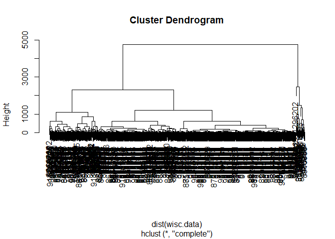
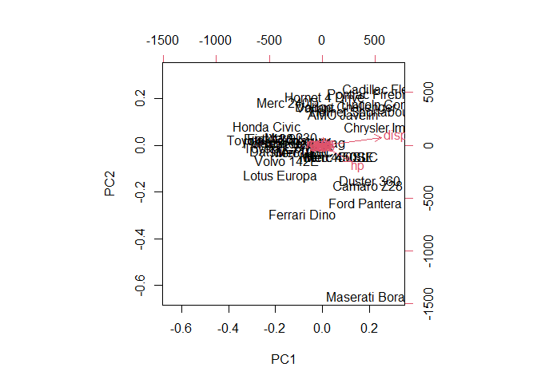
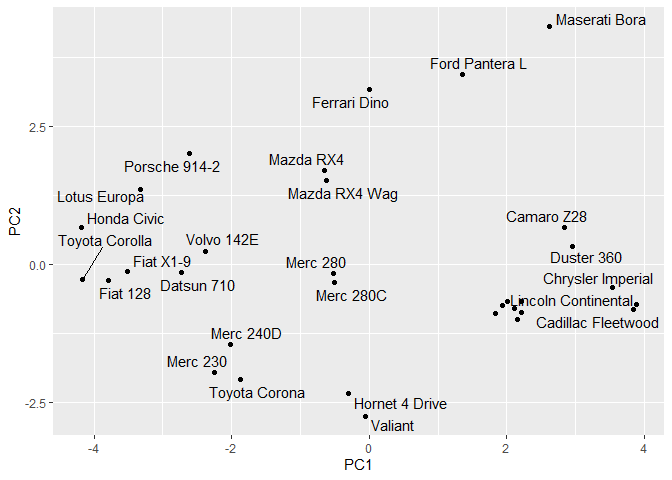
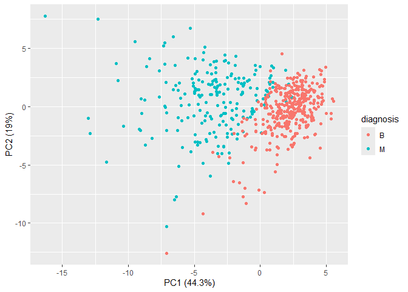
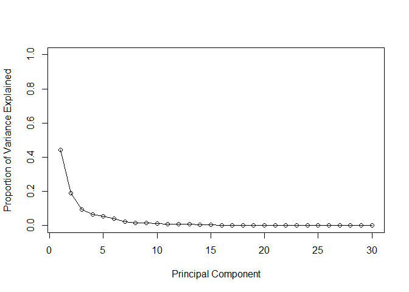
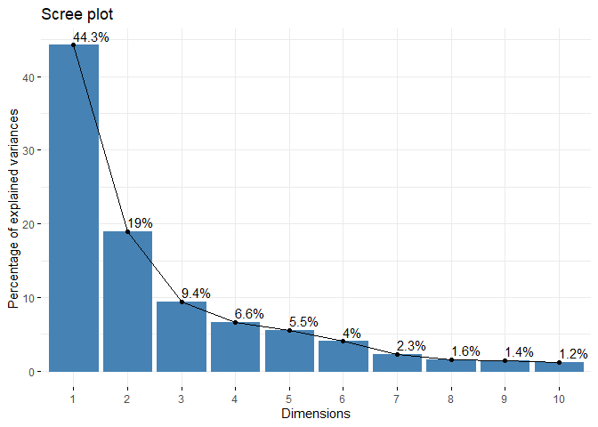
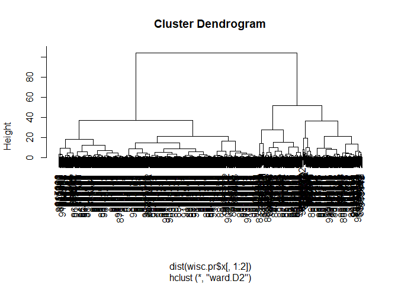

# Class 8: Breast cancer mini project
Dalena (PID: A17327787)

- [Background](#background)
- [Data import](#data-import)
- [Clustering](#clustering)
- [Principal Component Analysis](#principal-component-analysis)
  - [The importance of data scaling](#the-importance-of-data-scaling)
  - [PCA of wisc.data](#pca-of-wiscdata)
  - [Let’s make the main PC1 vs PC2](#lets-make-the-main-pc1-vs-pc2)
- [Variance explained](#variance-explained)
- [5. Combining Methods](#5-combining-methods)
  - [Clustering on PCA results](#clustering-on-pca-results)
- [7. Prediction](#7-prediction)

## Background

This source provides materials for a class mini-project focused on
unsupervised learning analysis of human breast cancer cell data.
Students will conduct principal component analysis (PCA) for
dimensionality reduction and then apply hierarchical and k-means
clustering techniques. The project involves exploratory data analysis,
interpreting PCA results, evaluating clustering performance by comparing
cluster assignments to actual diagnoses, and optionally combining PCA
with clustering. The goal is to identify potential groupings within the
cell data based on their characteristics without prior knowledge of
malignancy, and the project concludes with an application of the PCA
model to classify new patient samples.

## Data import

Our data come from the U. of Wisconsin Medical Center

``` r
wisc.df <-read.csv("WisconsinCancer.csv", row.names=1)
head(wisc.df)
```

             diagnosis radius_mean texture_mean perimeter_mean area_mean
    842302           M       17.99        10.38         122.80    1001.0
    842517           M       20.57        17.77         132.90    1326.0
    84300903         M       19.69        21.25         130.00    1203.0
    84348301         M       11.42        20.38          77.58     386.1
    84358402         M       20.29        14.34         135.10    1297.0
    843786           M       12.45        15.70          82.57     477.1
             smoothness_mean compactness_mean concavity_mean concave.points_mean
    842302           0.11840          0.27760         0.3001             0.14710
    842517           0.08474          0.07864         0.0869             0.07017
    84300903         0.10960          0.15990         0.1974             0.12790
    84348301         0.14250          0.28390         0.2414             0.10520
    84358402         0.10030          0.13280         0.1980             0.10430
    843786           0.12780          0.17000         0.1578             0.08089
             symmetry_mean fractal_dimension_mean radius_se texture_se perimeter_se
    842302          0.2419                0.07871    1.0950     0.9053        8.589
    842517          0.1812                0.05667    0.5435     0.7339        3.398
    84300903        0.2069                0.05999    0.7456     0.7869        4.585
    84348301        0.2597                0.09744    0.4956     1.1560        3.445
    84358402        0.1809                0.05883    0.7572     0.7813        5.438
    843786          0.2087                0.07613    0.3345     0.8902        2.217
             area_se smoothness_se compactness_se concavity_se concave.points_se
    842302    153.40      0.006399        0.04904      0.05373           0.01587
    842517     74.08      0.005225        0.01308      0.01860           0.01340
    84300903   94.03      0.006150        0.04006      0.03832           0.02058
    84348301   27.23      0.009110        0.07458      0.05661           0.01867
    84358402   94.44      0.011490        0.02461      0.05688           0.01885
    843786     27.19      0.007510        0.03345      0.03672           0.01137
             symmetry_se fractal_dimension_se radius_worst texture_worst
    842302       0.03003             0.006193        25.38         17.33
    842517       0.01389             0.003532        24.99         23.41
    84300903     0.02250             0.004571        23.57         25.53
    84348301     0.05963             0.009208        14.91         26.50
    84358402     0.01756             0.005115        22.54         16.67
    843786       0.02165             0.005082        15.47         23.75
             perimeter_worst area_worst smoothness_worst compactness_worst
    842302            184.60     2019.0           0.1622            0.6656
    842517            158.80     1956.0           0.1238            0.1866
    84300903          152.50     1709.0           0.1444            0.4245
    84348301           98.87      567.7           0.2098            0.8663
    84358402          152.20     1575.0           0.1374            0.2050
    843786            103.40      741.6           0.1791            0.5249
             concavity_worst concave.points_worst symmetry_worst
    842302            0.7119               0.2654         0.4601
    842517            0.2416               0.1860         0.2750
    84300903          0.4504               0.2430         0.3613
    84348301          0.6869               0.2575         0.6638
    84358402          0.4000               0.1625         0.2364
    843786            0.5355               0.1741         0.3985
             fractal_dimension_worst
    842302                   0.11890
    842517                   0.08902
    84300903                 0.08758
    84348301                 0.17300
    84358402                 0.07678
    843786                   0.12440

> Q1. How many patients/samples are in this dataset?

``` r
nrow(wisc.df)
```

    [1] 569

> Q2. How many of the observations have a malignant diagnosis?

``` r
table(wisc.df$diagnosis)
```


      B   M 
    357 212 

``` r
sum(wisc.df$diagnosis =="M")
```

    [1] 212

> Q3. How many variables/features in the data are suffixed with \_mean?

``` r
colnames(wisc.df)
```

     [1] "diagnosis"               "radius_mean"            
     [3] "texture_mean"            "perimeter_mean"         
     [5] "area_mean"               "smoothness_mean"        
     [7] "compactness_mean"        "concavity_mean"         
     [9] "concave.points_mean"     "symmetry_mean"          
    [11] "fractal_dimension_mean"  "radius_se"              
    [13] "texture_se"              "perimeter_se"           
    [15] "area_se"                 "smoothness_se"          
    [17] "compactness_se"          "concavity_se"           
    [19] "concave.points_se"       "symmetry_se"            
    [21] "fractal_dimension_se"    "radius_worst"           
    [23] "texture_worst"           "perimeter_worst"        
    [25] "area_worst"              "smoothness_worst"       
    [27] "compactness_worst"       "concavity_worst"        
    [29] "concave.points_worst"    "symmetry_worst"         
    [31] "fractal_dimension_worst"

``` r
length(grep("mean",colnames(wisc.df),value=T))
```

    [1] 10

There is a diagnosis column that is the clinician consensus that I want
to exclude from any further analysis. We will come back later and
compare our results to this diagnosis.

``` r
diagnosis <-as.factor(wisc.df$diagnosis)
head(diagnosis)
```

    [1] M M M M M M
    Levels: B M

Now we can remove it from the `wisc.df`

``` r
wisc.data <- wisc.df[,-1]
```

## Clustering

Let;s try a `hclust()`

``` r
hc <-hclust(dist(wisc.data))
plot(hc)
```



We can extract clusters from this rather poor dendrogram/tree with the
`cutree()`

``` r
grps <- cutree(hc, k=2)
```

How many individuals in each cluster?

``` r
table(grps)
```

    grps
      1   2 
    549  20 

``` r
table(diagnosis)
```

    diagnosis
      B   M 
    357 212 

We can generate a cross-table that compares our cluster `grps` vector
without `diagnosis` vector values

``` r
table(diagnosis,grps)
```

             grps
    diagnosis   1   2
            B 357   0
            M 192  20

## Principal Component Analysis

### The importance of data scaling

The main function for PCA in base R is `prcomp()`. It has a default
input parameter of `scale = FALSE`.

``` r
#prcomp()
head(mtcars)
```

                       mpg cyl disp  hp drat    wt  qsec vs am gear carb
    Mazda RX4         21.0   6  160 110 3.90 2.620 16.46  0  1    4    4
    Mazda RX4 Wag     21.0   6  160 110 3.90 2.875 17.02  0  1    4    4
    Datsun 710        22.8   4  108  93 3.85 2.320 18.61  1  1    4    1
    Hornet 4 Drive    21.4   6  258 110 3.08 3.215 19.44  1  0    3    1
    Hornet Sportabout 18.7   8  360 175 3.15 3.440 17.02  0  0    3    2
    Valiant           18.1   6  225 105 2.76 3.460 20.22  1  0    3    1

We could do a PCA of this data as is and it could be misleading…

``` r
pc <-prcomp(mtcars)
biplot(pc)
```



Let’s look at the mean values of each column and their STDEV

``` r
colMeans(mtcars)
```

           mpg        cyl       disp         hp       drat         wt       qsec 
     20.090625   6.187500 230.721875 146.687500   3.596563   3.217250  17.848750 
            vs         am       gear       carb 
      0.437500   0.406250   3.687500   2.812500 

``` r
apply(mtcars,2,sd)
```

            mpg         cyl        disp          hp        drat          wt 
      6.0269481   1.7859216 123.9386938  68.5628685   0.5346787   0.9784574 
           qsec          vs          am        gear        carb 
      1.7869432   0.5040161   0.4989909   0.7378041   1.6152000 

We can “scale” this data before PCA to get a much better representation
and analysis of all the columns.

``` r
mtscale<-scale(mtcars)
```

``` r
round(colMeans(mtscale))
```

     mpg  cyl disp   hp drat   wt qsec   vs   am gear carb 
       0    0    0    0    0    0    0    0    0    0    0 

``` r
apply(mtscale,2,sd)
```

     mpg  cyl disp   hp drat   wt qsec   vs   am gear carb 
       1    1    1    1    1    1    1    1    1    1    1 

``` r
pc.scale <- prcomp(mtscale)
```

We can look at the two main results figures from PCA – the “PC plot”
(aka score plot, ordination plot, or PC1 vs PC2 plot). The “loadings
plot” is how the original variables contribute to the new PCs.

A loadings plot of the unscaled PCA results

``` r
library(ggplot2)

ggplot(pc$rotation)+
  aes(PC1, rownames(pc$rotation))+
geom_col()
```


Loadings plot of the scaled data.

``` r
ggplot(pc.scale$rotation)+
  aes(PC1, rownames(pc$rotation))+
geom_col()
```


PC plot of scaled PCA results

``` r
library(ggrepel)

ggplot(pc.scale$x)+
  aes(PC1, PC2, label=rownames(pc.scale$x))+
  geom_point()+
  geom_text_repel()
```

    Warning: ggrepel: 7 unlabeled data points (too many overlaps). Consider
    increasing max.overlaps



> **Key point**: In general, We will set `scale=TRUE` when we do PCA.
> THis is not the default but probably should be…

We can check the SD and mean of the different columns in `wisc.data` to
see if we need to scale - hint: we do!

### PCA of wisc.data

``` r
wisc.pr <- prcomp(wisc.data, scale=TRUE)
```

To see how well PCA is doing here in terms of capturing the variance (or
spread) in the data, we can use the `summary()` function.

``` r
summary(wisc.pr)
```

    Importance of components:
                              PC1    PC2     PC3     PC4     PC5     PC6     PC7
    Standard deviation     3.6444 2.3857 1.67867 1.40735 1.28403 1.09880 0.82172
    Proportion of Variance 0.4427 0.1897 0.09393 0.06602 0.05496 0.04025 0.02251
    Cumulative Proportion  0.4427 0.6324 0.72636 0.79239 0.84734 0.88759 0.91010
                               PC8    PC9    PC10   PC11    PC12    PC13    PC14
    Standard deviation     0.69037 0.6457 0.59219 0.5421 0.51104 0.49128 0.39624
    Proportion of Variance 0.01589 0.0139 0.01169 0.0098 0.00871 0.00805 0.00523
    Cumulative Proportion  0.92598 0.9399 0.95157 0.9614 0.97007 0.97812 0.98335
                              PC15    PC16    PC17    PC18    PC19    PC20   PC21
    Standard deviation     0.30681 0.28260 0.24372 0.22939 0.22244 0.17652 0.1731
    Proportion of Variance 0.00314 0.00266 0.00198 0.00175 0.00165 0.00104 0.0010
    Cumulative Proportion  0.98649 0.98915 0.99113 0.99288 0.99453 0.99557 0.9966
                              PC22    PC23   PC24    PC25    PC26    PC27    PC28
    Standard deviation     0.16565 0.15602 0.1344 0.12442 0.09043 0.08307 0.03987
    Proportion of Variance 0.00091 0.00081 0.0006 0.00052 0.00027 0.00023 0.00005
    Cumulative Proportion  0.99749 0.99830 0.9989 0.99942 0.99969 0.99992 0.99997
                              PC29    PC30
    Standard deviation     0.02736 0.01153
    Proportion of Variance 0.00002 0.00000
    Cumulative Proportion  1.00000 1.00000

> Q4. From your results, what proportion of the original variance is
> captured by the first principal components (PC1)?

> > 0.4427 or 44.27% of the original variance is captured by PC1.

> Q5. How many principal components (PCs) are required to describe at
> least 70% of the original variance in the data?

> > Three PCs are required to describe at least 70% of the original
> > variance in the data. At PC3 0.72636 is found as the cumulative
> > proportion.

> Q6. How many principal components (PCs) are required to describe at
> least 90% of the original variance in the data?

> > Seven PCs are required to describe at least 90% of original variance
> > in the data.

``` r
biplot(wisc.pr)
```


> Q7. What stands out to you about this plot? Is it easy or difficult to
> understand? Why?

> > The trends are difficult to see and interpret on this graph. There
> > is too many points (and labels) on the graph. The rownames and ids
> > are used in the plot.

> Q8. Generate a scatter plot for principal components 1 and 3. What do
> you notice about these plots?

> > There is two many clusters present and the plots are not labeled to
> > show the proportion of variance. The black cluster, benign group are
> > less scattered and more to the positive sides of PC3 than the
> > malignant grouP.

``` r
plot(wisc.pr$x[,],col=diagnosis,xlab="PC1",ylab="PC3")
```


### Let’s make the main PC1 vs PC2

``` r
ggplot(wisc.pr$x)+
  aes(PC1, PC2, col=diagnosis)+
  geom_point()+
  xlab("PC1 (44.3%)")+
  ylab("PC2 (19%)")
```



## Variance explained

Calculate the variance of each component by squaring the STDEV
component.

``` r
pr.var <- wisc.pr$sdev^2
head(pr.var)
```

    [1] 13.281608  5.691355  2.817949  1.980640  1.648731  1.207357

Calculate the variance explained by each principal component

``` r
# Variance explained by each principal component

pve <-(wisc.pr$sdev)^2 / sum((wisc.pr$sdev)^2)

#Plot variance explained for each principal component

plot(pve, xlab = "Principal Component", 
     ylab = "Proportion of Variance Explained", 
     ylim = c(0, 1), type = "o")
```



``` r
barplot(pve, ylab = "Precent of Variance Explained",
     names.arg=paste0("PC",1:length(pve)), las=2, axes = FALSE)
axis(2, at=pve, labels=round(pve,2)*100 )
```


``` r
library(factoextra)
```

    Welcome! Want to learn more? See two factoextra-related books at https://goo.gl/ve3WBa

``` r
fviz_eig(wisc.pr,addlabels=TRUE)
```



> Q9. For the first principal component, what is the component of the
> loading vector (i.e. wisc.pr\$rotation\[,1\]) for the feature
> concave.points_mean?

> > -0.2608538. This shows you how strongly concave.points_mean has an
> > influence on PC1.

``` r
wisc.pr$rotation["concave.points_mean", 1]
```

    [1] -0.2608538

> Q10. What is the minimum number of principal components required to
> explain 80% of the variance of the data?

> > 5 PCs are required to explain 80% of the variance of the data?

## 5. Combining Methods

We can take our PCA results and use them as a basis set for other
analysis such as clustering.

> Q13. Which method gives your favorite results for the same data.dist
> dataset? Explain your reasoning.

> > My favorite method is “ward.D2” because it is generally more
> > efficient at finding compact clusters and organizes them
> > spherically.

### Clustering on PCA results

``` r
wisc.pr.hclust <- hclust(dist(wisc.pr$x[,1:2]),method="ward.D2")
plot(wisc.pr.hclust)
```



We can “cut” this tree to yield our clusters (groups):

``` r
pc.grps<-cutree(wisc.pr.hclust,k=2)
table(pc.grps)
```

    pc.grps
      1   2 
    195 374 

> Q15. How well does the newly created model with four clusters separate
> out the two diagnoses?

> > In the format of a table, it does really well in separating the two
> > diagnoses and identifying the two different groups “B” and “”

``` r
table(diagnosis,pc.grps)
```

             pc.grps
    diagnosis   1   2
            B  18 339
            M 177  35

``` r
table(diagnosis)
```

    diagnosis
      B   M 
    357 212 

> Q16. How well do the k-means and hierarchical clustering models you
> created in previous sections (i.e. before PCA) do in terms of
> separating the diagnoses? Again, use the table() function to compare
> the output of each model (wisc.km\$cluster and wisc.hclust.clusters)
> with the vector containing the actual diagnoses.

> > They did really badly. We do much better after PCA - the new PCA
> > variables (what we call a basis set) give us much better separation
> > of M and B

## 7. Prediction

We can use our PCA for the analysis of of new “unseen” data. In this
case from U. Mich.

``` r
url <- "https://tinyurl.com/new-samples-CSV"
new <- read.csv(url)
npc <- predict(wisc.pr, newdata=new)
npc
```

               PC1       PC2        PC3        PC4       PC5        PC6        PC7
    [1,]  2.576616 -3.135913  1.3990492 -0.7631950  2.781648 -0.8150185 -0.3959098
    [2,] -4.754928 -3.009033 -0.1660946 -0.6052952 -1.140698 -1.2189945  0.8193031
                PC8       PC9       PC10      PC11      PC12      PC13     PC14
    [1,] -0.2307350 0.1029569 -0.9272861 0.3411457  0.375921 0.1610764 1.187882
    [2,] -0.3307423 0.5281896 -0.4855301 0.7173233 -1.185917 0.5893856 0.303029
              PC15       PC16        PC17        PC18        PC19       PC20
    [1,] 0.3216974 -0.1743616 -0.07875393 -0.11207028 -0.08802955 -0.2495216
    [2,] 0.1299153  0.1448061 -0.40509706  0.06565549  0.25591230 -0.4289500
               PC21       PC22       PC23       PC24        PC25         PC26
    [1,]  0.1228233 0.09358453 0.08347651  0.1223396  0.02124121  0.078884581
    [2,] -0.1224776 0.01732146 0.06316631 -0.2338618 -0.20755948 -0.009833238
                 PC27        PC28         PC29         PC30
    [1,]  0.220199544 -0.02946023 -0.015620933  0.005269029
    [2,] -0.001134152  0.09638361  0.002795349 -0.019015820

> Q18. Which of these new patients should we prioritize for follow up
> based on your results?

> > Patient 2
