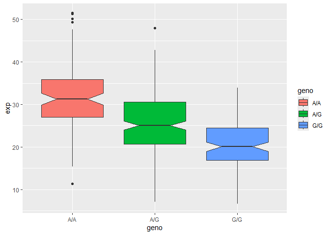

# class12
Dalena Pham, PID: A17327787

# Section 1. Proportion og G/G in a population

Downloaded a CSV file from Ensemble and we will read the CSV file

``` r
mxl <-read.csv("373531-SampleGenotypes-Homo_sapiens_Variation_Sample_rs8067378.csv")

head(mxl)
```

      Sample..Male.Female.Unknown. Genotype..forward.strand. Population.s. Father
    1                  NA19648 (F)                       A|A ALL, AMR, MXL      -
    2                  NA19649 (M)                       G|G ALL, AMR, MXL      -
    3                  NA19651 (F)                       A|A ALL, AMR, MXL      -
    4                  NA19652 (M)                       G|G ALL, AMR, MXL      -
    5                  NA19654 (F)                       G|G ALL, AMR, MXL      -
    6                  NA19655 (M)                       A|G ALL, AMR, MXL      -
      Mother
    1      -
    2      -
    3      -
    4      -
    5      -
    6      -

``` r
table(mxl$Genotype..forward.strand.)
```


    A|A A|G G|A G|G 
     22  21  12   9 

``` r
table(mxl$Genotype..forward.strand.)/nrow(mxl)
```


         A|A      A|G      G|A      G|G 
    0.343750 0.328125 0.187500 0.140625 

## Section 4: Population Scale Analysis

One sample is obviously not enough to know what is happening in a
population. You are interested in assessing genetic differences on a
population scale. So, you processed about ~230 samples and did the
normalization on a genome level. Now, you want to find whether there is
any association of the 4 asthma-associated SNPs (rs8067378…) on ORMDL3
expression.

> Q13: Read this file into R and determine the sample size for each
> genotype and their corresponding median expression levels for each of
> these genotypes?

``` r
expr <-read.table("rs8067378_ENSG00000172057.6.txt")
head(expr)
```

       sample geno      exp
    1 HG00367  A/G 28.96038
    2 NA20768  A/G 20.24449
    3 HG00361  A/A 31.32628
    4 HG00135  A/A 34.11169
    5 NA18870  G/G 18.25141
    6 NA11993  A/A 32.89721

``` r
nrow(expr)
```

    [1] 462

``` r
table(expr$geno)
```


    A/A A/G G/G 
    108 233 121 

``` r
library(ggplot2)
```

> Q14: Generate a boxplot with a box per genotype, what could you infer
> from the relative expression value between A/A and G/G displayed in
> this plot? Does the SNP affect the expression of ORMDL3?

## Box plot

> > There is a higher expression value for A/A than G/G. The SNP does
> > affect the expression of ORMDL3.

``` r
ggplot(expr)+aes(geno,exp,fill=geno)+
  geom_boxplot(notch=TRUE)
```


