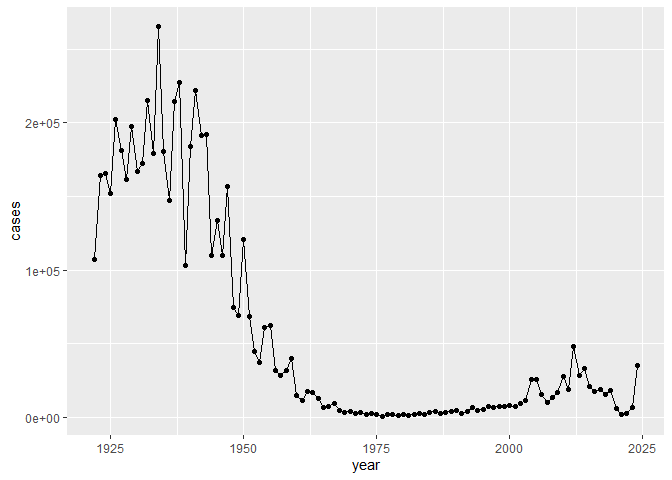
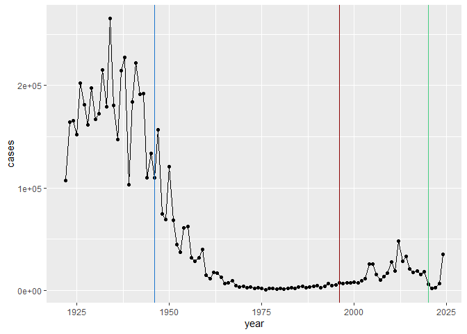
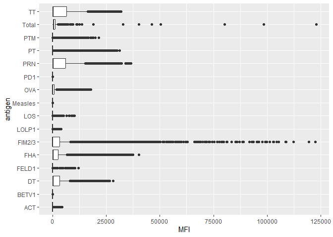
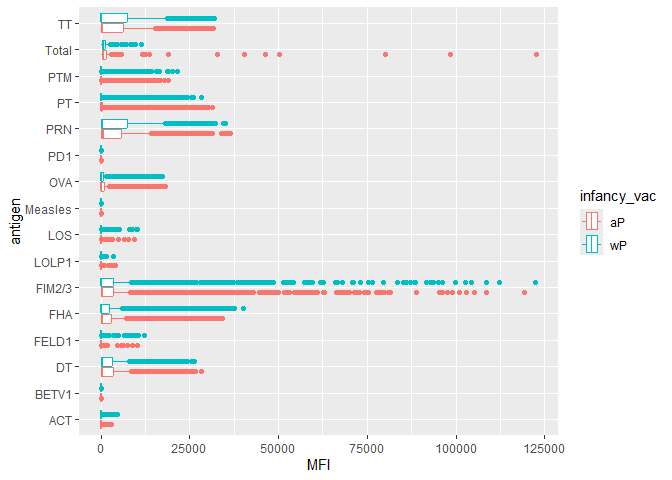
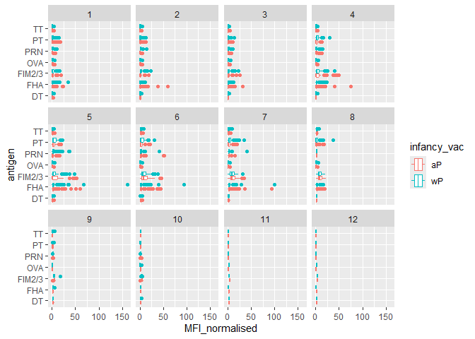
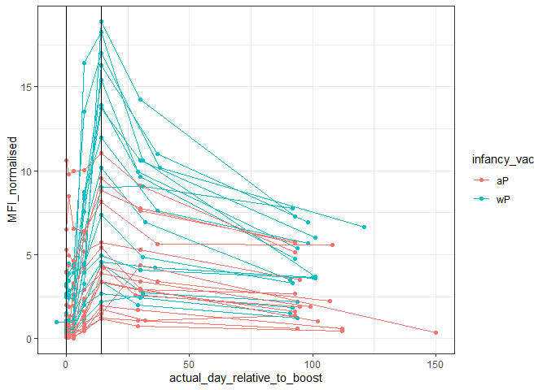

# class18
Dalena (A17327787)

- [Background](#background)
- [Investing Pertussis Cases By
  Year](#investing-pertussis-cases-by-year)
- [A tale of two vaccines (wP & aP)](#a-tale-of-two-vaccines-wp--ap)
- [Exploring CMI-PB data](#exploring-cmi-pb-data)
- [Focus on IgG levels](#focus-on-igg-levels)

## Background

Pertussis (a.ka. whopping cough) is a common lung infection caused by
the bacteria *B. Pertussis*.

The CDC tracks cases of Pertussis in the US:
https://www.cdc.gov/pertussis/php/surveillance/pertussis-cases-by-year.html

## Investing Pertussis Cases By Year

``` r
cdc <- data.frame( year = c(1922L,1923L,1924L,1925L,
                                          1926L,1927L,1928L,1929L,1930L,1931L,
                                          1932L,1933L,1934L,1935L,1936L,
                                          1937L,1938L,1939L,1940L,1941L,1942L,
                                          1943L,1944L,1945L,1946L,1947L,
                                          1948L,1949L,1950L,1951L,1952L,
                                          1953L,1954L,1955L,1956L,1957L,1958L,
                                          1959L,1960L,1961L,1962L,1963L,
                                          1964L,1965L,1966L,1967L,1968L,1969L,
                                          1970L,1971L,1972L,1973L,1974L,
                                          1975L,1976L,1977L,1978L,1979L,1980L,
                                          1981L,1982L,1983L,1984L,1985L,
                                          1986L,1987L,1988L,1989L,1990L,
                                          1991L,1992L,1993L,1994L,1995L,1996L,
                                          1997L,1998L,1999L,2000L,2001L,
                                          2002L,2003L,2004L,2005L,2006L,2007L,
                                          2008L,2009L,2010L,2011L,2012L,
                                          2013L,2014L,2015L,2016L,2017L,2018L,
                                          2019L,2020L,2021L,2022L,2023L,2024L),

cases = c(107473,164191,165418,152003,
                                          202210,181411,161799,197371,
                                          166914,172559,215343,179135,265269,
                                          180518,147237,214652,227319,103188,
                                          183866,222202,191383,191890,109873,
                                          133792,109860,156517,74715,69479,
                                          120718,68687,45030,37129,60886,
                                          62786,31732,28295,32148,40005,
                                          14809,11468,17749,17135,13005,6799,
                                          7717,9718,4810,3285,4249,3036,
                                          3287,1759,2402,1738,1010,2177,2063,
                                          1623,1730,1248,1895,2463,2276,
                                          3589,4195,2823,3450,4157,4570,
                                          2719,4083,6586,4617,5137,7796,6564,
                                          7405,7298,7867,7580,9771,11647,
                                          25827,25616,15632,10454,13278,
                                          16858,27550,18719,48277,28639,32971,
                                          20762,17972,18975,15609,18617,
                                          6124,2116,3044,7063,35493)
       )
```

> Q1. With the help of the R “addin” package datapasta assign the CDC
> pertussis case number data to a data frame called `cdc` and use ggplot
> to make a plot of cases numbers over time.

``` r
library(ggplot2)
```

``` r
ggplot(cdc) +
  aes(year, cases) +
  geom_point() + 
  geom_line()
```



## A tale of two vaccines (wP & aP)

> Q2. Using the ggplot `geom_vline()` function add lines to your
> previous plot for the 1946 introduction of the wP vaccine and the 1996
> switch to aP vaccine (see example in the hint below). 2020 is the
> CMI-PB Project. WHat do you notice?

``` r
library(ggplot2)
ggplot(cdc) +
  aes(year, cases) +
  geom_point() + 
  geom_line() +
geom_vline(xintercept = 1946, col="dodgerblue3") +
  geom_vline(xintercept = 1996, col="red4") +
  geom_vline(xintercept = 2020, col="seagreen3")
```



> > The newer **aP** is less effective in long term than the older
> > **wP** vaccine.

## Exploring CMI-PB data

CMI-PB (Computational Models of Immunity - Pertussis boost). The new and
ongoing CMI-PB project aims to provide the scientific community with
this very information. In particular, CMI-PB tracks and makes freely
available long-term humoral and cellular immune response data for a
large number of individuals who received either DTwP or DTaP combination
vaccines in infancy followed by Tdap booster vaccinations. This includes
complete API access to longitudinal RNA-Seq, AB Titer, Olink, and live
cell assay results directly from their website: https://www.cmi-pb.org/

Use **jsonlitee** package

``` r
##Read, write and process JSON data

library(jsonlite)

subject <- read_json("https://www.cmi-pb.org/api/v5_1/subject", 
                     simplifyVector = TRUE)

head(subject)
```

      subject_id infancy_vac biological_sex              ethnicity  race
    1          1          wP         Female Not Hispanic or Latino White
    2          2          wP         Female Not Hispanic or Latino White
    3          3          wP         Female                Unknown White
    4          4          wP           Male Not Hispanic or Latino Asian
    5          5          wP           Male Not Hispanic or Latino Asian
    6          6          wP         Female Not Hispanic or Latino White
      year_of_birth date_of_boost      dataset
    1    1986-01-01    2016-09-12 2020_dataset
    2    1968-01-01    2019-01-28 2020_dataset
    3    1983-01-01    2016-10-10 2020_dataset
    4    1988-01-01    2016-08-29 2020_dataset
    5    1991-01-01    2016-08-29 2020_dataset
    6    1988-01-01    2016-10-10 2020_dataset

> Q3. How many subjects (i.e. enrolled people) are there in this
> dataset?

``` r
nrow(subject)
```

    [1] 172

> Q4. How many “aP” and “wP” infancy vaccinated subjects are in the
> dataset?

``` r
table(subject$infancy_vac)
```


    aP wP 
    87 85 

> Q5. How many male/female subjects/patients are in the dataset?

``` r
table(subject$biological_sex)
```


    Female   Male 
       112     60 

> Q6. What is the breakdown of race and biological sex?

``` r
table(subject$race, subject$biological_sex)
```

                                               
                                                Female Male
      American Indian/Alaska Native                  0    1
      Asian                                         32   12
      Black or African American                      2    3
      More Than One Race                            15    4
      Native Hawaiian or Other Pacific Islander      1    1
      Unknown or Not Reported                       14    7
      White                                         48   32

> Q7. Is this representative of the US Population?

> > No.

Let’s read another database table from the CMI-PB

``` r
specimen <- read_json("https://www.cmi-pb.org/api/v5_1/specimen",
                      simplifyVector = TRUE)

ab_data <- read_json("https://www.cmi-pb.org/api/v5_1/plasma_ab_titer",
                     simplifyVector = TRUE)
```

“Join” these tables to get our information together. Use **dplyr**
package and the `inner_join()` function.

``` r
library(dplyr)
```


    Attaching package: 'dplyr'

    The following objects are masked from 'package:stats':

        filter, lag

    The following objects are masked from 'package:base':

        intersect, setdiff, setequal, union

``` r
meta <- inner_join(subject, specimen)
```

    Joining with `by = join_by(subject_id)`

``` r
head(meta)
```

      subject_id infancy_vac biological_sex              ethnicity  race
    1          1          wP         Female Not Hispanic or Latino White
    2          1          wP         Female Not Hispanic or Latino White
    3          1          wP         Female Not Hispanic or Latino White
    4          1          wP         Female Not Hispanic or Latino White
    5          1          wP         Female Not Hispanic or Latino White
    6          1          wP         Female Not Hispanic or Latino White
      year_of_birth date_of_boost      dataset specimen_id
    1    1986-01-01    2016-09-12 2020_dataset           1
    2    1986-01-01    2016-09-12 2020_dataset           2
    3    1986-01-01    2016-09-12 2020_dataset           3
    4    1986-01-01    2016-09-12 2020_dataset           4
    5    1986-01-01    2016-09-12 2020_dataset           5
    6    1986-01-01    2016-09-12 2020_dataset           6
      actual_day_relative_to_boost planned_day_relative_to_boost specimen_type
    1                           -3                             0         Blood
    2                            1                             1         Blood
    3                            3                             3         Blood
    4                            7                             7         Blood
    5                           11                            14         Blood
    6                           32                            30         Blood
      visit
    1     1
    2     2
    3     3
    4     4
    5     5
    6     6

``` r
head(ab_data)
```

      specimen_id isotype is_antigen_specific antigen        MFI MFI_normalised
    1           1     IgE               FALSE   Total 1110.21154       2.493425
    2           1     IgE               FALSE   Total 2708.91616       2.493425
    3           1     IgG                TRUE      PT   68.56614       3.736992
    4           1     IgG                TRUE     PRN  332.12718       2.602350
    5           1     IgG                TRUE     FHA 1887.12263      34.050956
    6           1     IgE                TRUE     ACT    0.10000       1.000000
       unit lower_limit_of_detection
    1 UG/ML                 2.096133
    2 IU/ML                29.170000
    3 IU/ML                 0.530000
    4 IU/ML                 6.205949
    5 IU/ML                 4.679535
    6 IU/ML                 2.816431

“join” again to get ab_data and meta all together

``` r
abdata <- inner_join(ab_data, meta)
```

    Joining with `by = join_by(specimen_id)`

``` r
head(abdata)
```

      specimen_id isotype is_antigen_specific antigen        MFI MFI_normalised
    1           1     IgE               FALSE   Total 1110.21154       2.493425
    2           1     IgE               FALSE   Total 2708.91616       2.493425
    3           1     IgG                TRUE      PT   68.56614       3.736992
    4           1     IgG                TRUE     PRN  332.12718       2.602350
    5           1     IgG                TRUE     FHA 1887.12263      34.050956
    6           1     IgE                TRUE     ACT    0.10000       1.000000
       unit lower_limit_of_detection subject_id infancy_vac biological_sex
    1 UG/ML                 2.096133          1          wP         Female
    2 IU/ML                29.170000          1          wP         Female
    3 IU/ML                 0.530000          1          wP         Female
    4 IU/ML                 6.205949          1          wP         Female
    5 IU/ML                 4.679535          1          wP         Female
    6 IU/ML                 2.816431          1          wP         Female
                   ethnicity  race year_of_birth date_of_boost      dataset
    1 Not Hispanic or Latino White    1986-01-01    2016-09-12 2020_dataset
    2 Not Hispanic or Latino White    1986-01-01    2016-09-12 2020_dataset
    3 Not Hispanic or Latino White    1986-01-01    2016-09-12 2020_dataset
    4 Not Hispanic or Latino White    1986-01-01    2016-09-12 2020_dataset
    5 Not Hispanic or Latino White    1986-01-01    2016-09-12 2020_dataset
    6 Not Hispanic or Latino White    1986-01-01    2016-09-12 2020_dataset
      actual_day_relative_to_boost planned_day_relative_to_boost specimen_type
    1                           -3                             0         Blood
    2                           -3                             0         Blood
    3                           -3                             0         Blood
    4                           -3                             0         Blood
    5                           -3                             0         Blood
    6                           -3                             0         Blood
      visit
    1     1
    2     1
    3     1
    4     1
    5     1
    6     1

``` r
dim(abdata)
```

    [1] 61956    20

> Q8. How many Ab isotypes are there in the dataset?

``` r
table(abdata$isotype)
```


      IgE   IgG  IgG1  IgG2  IgG3  IgG4 
     6698  7265 11993 12000 12000 12000 

> Q9. How many different antigens are measured in the dataset?

``` r
table(abdata$antigen)
```


        ACT   BETV1      DT   FELD1     FHA  FIM2/3   LOLP1     LOS Measles     OVA 
       1970    1970    6318    1970    6712    6318    1970    1970    1970    6318 
        PD1     PRN      PT     PTM   Total      TT 
       1970    6712    6712    1970     788    6318 

> Q10. Make a boxplot of antigen levels across the whole dataset (MFI vs
> antigen)

``` r
ggplot(abdata) +
  aes(MFI, antigen) +
  geom_boxplot()
```

    Warning: Removed 1 row containing non-finite outside the scale range
    (`stat_boxplot()`).



> Q11. Are there obvious differences between aP and wP values?

``` r
ggplot(abdata) +
  aes(MFI, antigen, col=infancy_vac) +
  geom_boxplot()
```

    Warning: Removed 1 row containing non-finite outside the scale range
    (`stat_boxplot()`).



## Focus on IgG levels

IgG is the most abundant antibody in blood with four subclasses

``` r
igg <- abdata |> 
  filter(isotype == "IgG")

head(igg)
```

      specimen_id isotype is_antigen_specific antigen        MFI MFI_normalised
    1           1     IgG                TRUE      PT   68.56614       3.736992
    2           1     IgG                TRUE     PRN  332.12718       2.602350
    3           1     IgG                TRUE     FHA 1887.12263      34.050956
    4          19     IgG                TRUE      PT   20.11607       1.096366
    5          19     IgG                TRUE     PRN  976.67419       7.652635
    6          19     IgG                TRUE     FHA   60.76626       1.096457
       unit lower_limit_of_detection subject_id infancy_vac biological_sex
    1 IU/ML                 0.530000          1          wP         Female
    2 IU/ML                 6.205949          1          wP         Female
    3 IU/ML                 4.679535          1          wP         Female
    4 IU/ML                 0.530000          3          wP         Female
    5 IU/ML                 6.205949          3          wP         Female
    6 IU/ML                 4.679535          3          wP         Female
                   ethnicity  race year_of_birth date_of_boost      dataset
    1 Not Hispanic or Latino White    1986-01-01    2016-09-12 2020_dataset
    2 Not Hispanic or Latino White    1986-01-01    2016-09-12 2020_dataset
    3 Not Hispanic or Latino White    1986-01-01    2016-09-12 2020_dataset
    4                Unknown White    1983-01-01    2016-10-10 2020_dataset
    5                Unknown White    1983-01-01    2016-10-10 2020_dataset
    6                Unknown White    1983-01-01    2016-10-10 2020_dataset
      actual_day_relative_to_boost planned_day_relative_to_boost specimen_type
    1                           -3                             0         Blood
    2                           -3                             0         Blood
    3                           -3                             0         Blood
    4                           -3                             0         Blood
    5                           -3                             0         Blood
    6                           -3                             0         Blood
      visit
    1     1
    2     1
    3     1
    4     1
    5     1
    6     1

Same boxplot of antigen as before

``` r
ggplot(igg) +
  aes(MFI_normalised, antigen, col=infancy_vac) +
  geom_boxplot() +
  facet_wrap(~visit)
```



Focus in further in just one of these antigens - let’s pick PT
(Pertussis Toxin, one of the main toxins of the bacteria)

**2021_dataset** again for **IgG** antibody isotopes

``` r
table(igg$dataset)
```


    2020_dataset 2021_dataset 2022_dataset 2023_dataset 
            1182         1617         1456         3010 

``` r
pt_igg <- abdata |>
  filter(isotype=="IgG", 
         antigen=="PT", 
         dataset=="2021_dataset")
```

``` r
dim(pt_igg)
```

    [1] 231  20

``` r
ggplot(pt_igg) + 
  aes(actual_day_relative_to_boost,
      MFI_normalised, 
      col=infancy_vac,
      group=subject_id) +
  geom_point() +
  geom_line() +
  theme_bw() +
  geom_vline(xintercept = 0) +
  geom_vline(xintercept = 14)
```


